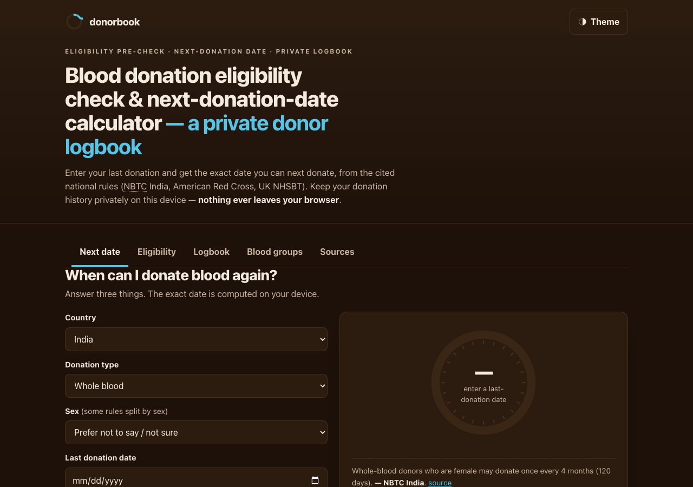

# donorbook

**Know exactly when you can donate blood again.** A blood-donation eligibility pre-check and next-donation-date calculator built from the *cited* rules of three national authorities (NBTC India, American Red Cross, UK NHSBT), with a private donor logbook that never leaves your browser. 100% client-side, zero dependencies, works fully offline.



## Why

The week after donating, the question is always the same: *"when can I donate blood again?"* Most answers online are a vague blog post or a lead-gen page that wants your details. The real answer is a simple date — your last donation plus your country's published interval — and it should be computable without handing your health information to anyone.

donorbook does exactly that. Pick your **country** and **donation type**, enter your **last-donation date**, and it computes the exact next-eligible date and a live countdown on the eligibility ring. It also runs a guided **eligibility pre-check**, keeps a private **donor logbook**, and shows a **blood-group compatibility** explorer — and every rule it uses is shown with its authority, verbatim quote, source link and last-verified date.

## Features

- **Next-donation-date calculator** — country (India / US / UK) × donation type (whole blood / platelets / plasma) × sex (where the authority splits by sex) × last-donation date → the exact next-eligible date and a day countdown on the eligibility ring.
- **Guided eligibility pre-check** — age, weight, haemoglobin and a fixed taxonomy of deferral reasons → *Likely eligible* / *Likely deferred until <date>* / *Ask the blood bank*, with the cited rule, source link and last-verified date behind every verdict.
- **Private donor logbook** — date, type, centre and notes, stored only in your browser's localStorage; per-type next-eligible date auto-computed, and a running yearly count against the country's published cap.
- **Blood-group compatibility explorer** — pick any of the 8 groups and see donate-to / receive-from for red cells or plasma (plasma runs the opposite way; AB is the universal plasma donor). The 8×8 matrix is re-derived from antigen–antibody first principles in the tests.
- **Exports as the handoff** — RFC-4180 CSV of your logbook, a locally generated `.ics` calendar file for your next-eligible date (the honest replacement for push notifications), and a printable wallet donor card.
- **Sources panel** — browse the entire ruleset: authority, verbatim quote, URL and last-verified date for every single rule.
- **100% offline** — no accounts, no network calls, no tracking. Enforced by the page's own security policy.

## Quickstart

Just open `index.html` in any modern browser — no build step, no server, no install.

- **Local:** double-click `index.html`, or run a static server in the folder.
- **Hosted:** **[Open donorbook live](https://sreenivas-sadhu-prabhakara.github.io/donorbook/)**

Your logbook, card and theme are saved in your browser's local storage, so they persist between visits on the same device.

## The rules & how they're verified

Every rule lives in `data/rules.js` with `source_name`, `source_url`, a verbatim `source_quote`, a `confidence` flag, and `last_verified` (2026-07-22). The engine reads its numbers **from** the corpus — no interval is hard-coded twice. See `sources/CITATIONS.md` for the full provenance of each figure, including:

- **NBTC India** — whole blood every 90 days (male) / 120 days (female), age 18–65, weight ≥45 kg, Hb ≥12.5 g/dl.
- **American Red Cross** — whole blood every 56 days, platelets every 7 days, plasma every 28 days; age 17, weight ≥110 lb.
- **UK NHSBT** — men every 12 weeks (84 days), women every 16 weeks (112 days); age 17–65 first-time; weight 50–158 kg.

The ABO/Rh blood-group matrix is derived from first principles and asserted against the shipped table in `test/rules.test.js`.

## Tests

```sh
node --test
```

The suite re-derives the date arithmetic to the day (including leap-year and year-cross boundaries), rebuilds the blood-group matrix from antigen–antibody rules and deep-equals it against the shipped table with a 128-check symmetry sweep, exercises the pre-check reducer (two deferrals → later resume date; any medication → *ask the blood bank*), asserts ruleset integrity and provenance, round-trips the CSV, and runs a 2,000-iteration property test on the next-date engine.

## Privacy

donorbook is built to be trustworthy with health information — because it can't do anything else.

- A strict Content-Security-Policy sets `connect-src 'none'`: the app **cannot** make any network request even if it tried.
- No external fonts, scripts, images, or analytics. Everything is self-contained.
- Your donation history and card live only in this browser's localStorage. Nothing is ever transmitted or stored anywhere but your own device.
- Because there are no network dependencies, it works with no signal at all. Clearing site data deletes your logbook — the CSV and print exports are your only backup.

## Disclaimer

donorbook is **not medical advice**. It is a *pre-check* built from the published general eligibility criteria of three named authorities (NBTC India, American Red Cross, UK NHSBT), each shown with a source link and a last-verified date of **2026-07-22**. It **never confirms eligibility** — the blood bank's on-site screening always decides. Rules change over time and individual blood banks differ. Medication and detailed medical-history questions are never computed here; the answer is always "ask the blood bank". This software is provided under the MIT License, "as is", without warranty of any kind; the authors accept no liability for any loss, injury, or damage arising from its use.

## License

[MIT](./LICENSE) © 2026 Sreenivas Sadhu Prabhakara
